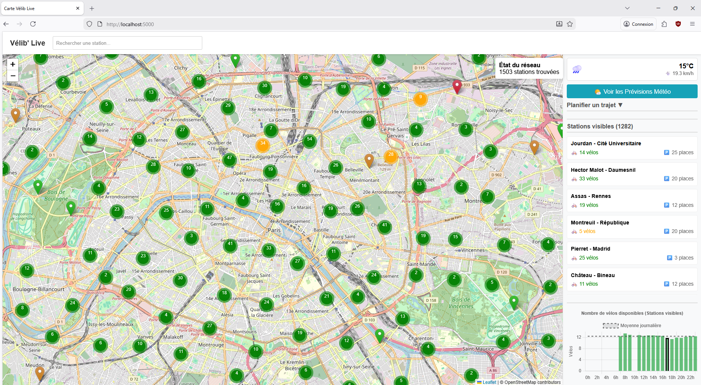
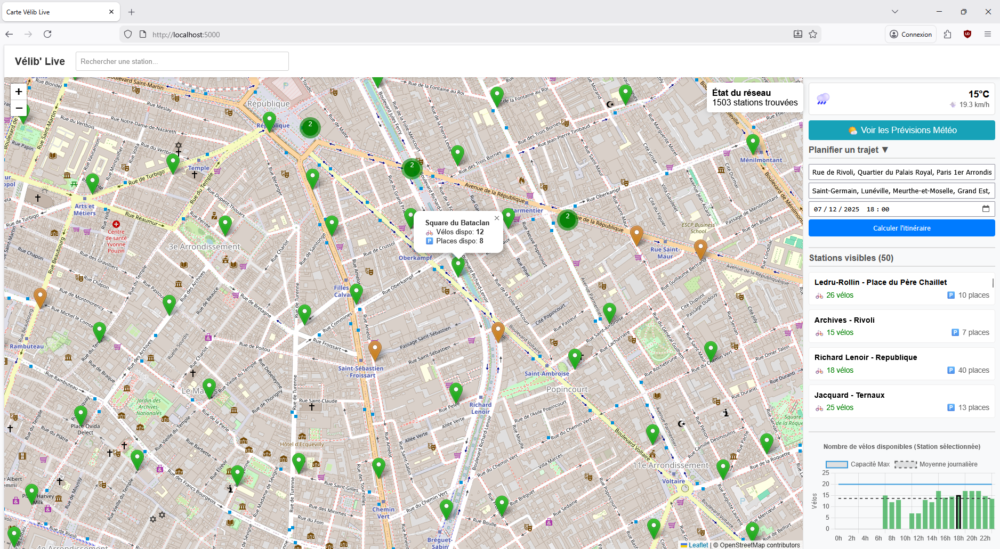
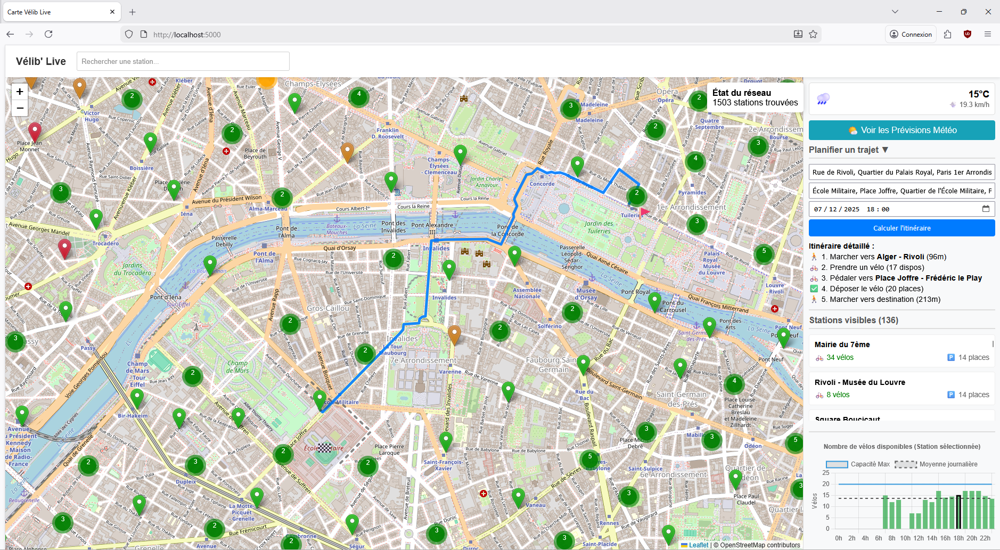
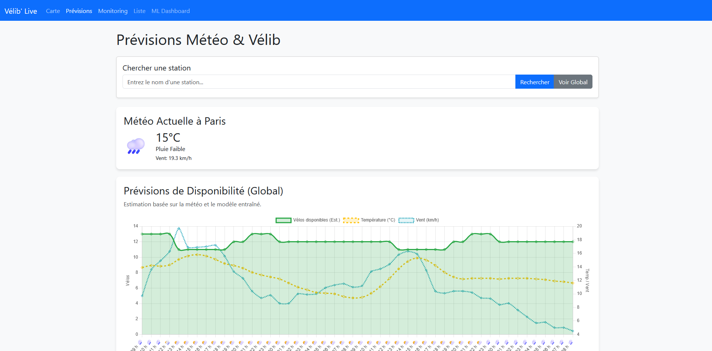
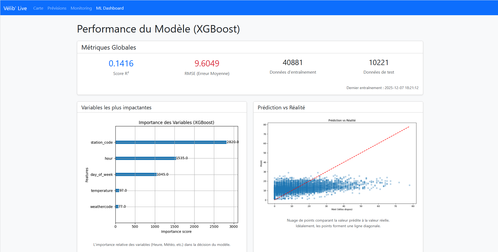
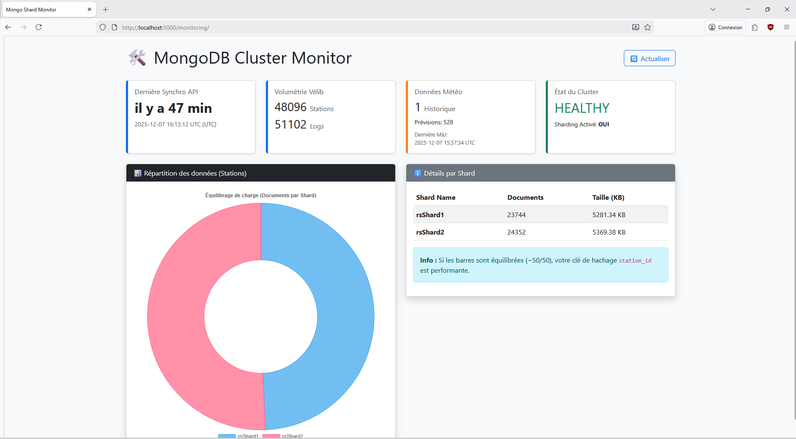
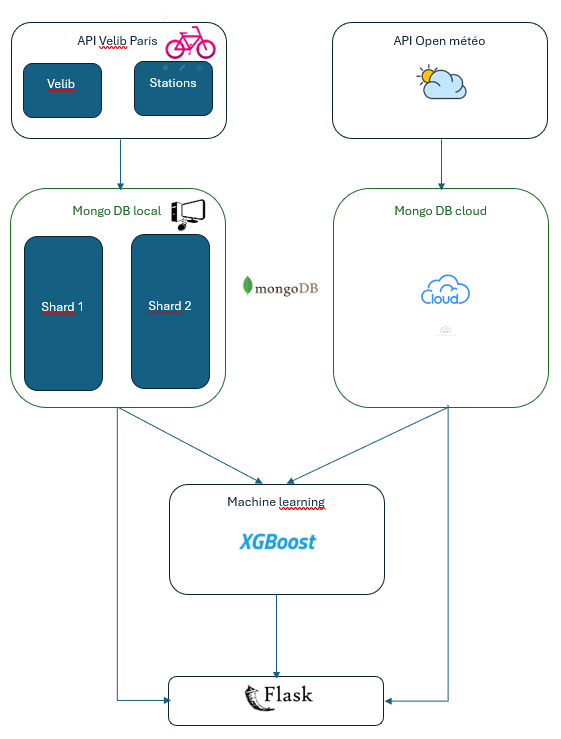

# Projet Big Data & Machine Learning : Vélib' Predictor

Ce projet est une application complète de **Big Data** et **Machine Learning** qui collecte, stocke, et analyse les données des stations Vélib' à Paris. Il croise ces données avec la météo pour prédire la disponibilité des vélos et affiche le tout sur une interface web interactive.

## 🚀 Fonctionnalités

1.  **Carte Interactive (Temps Réel)** :
    *   Visualisation de toutes les stations Vélib' sur une carte.
    
    *   Indicateurs de disponibilité (vert/orange/rouge) et popups détaillés.
    
    *   Widget météo en temps réel (Température, Vent, Description).
    *   **Recherche d'itinéraire** : Trouve la station de départ (avec vélos) et d'arrivée (avec places) les plus proches.
    


2.  **Prévisions (Machine Learning)** :
    *   Tableau de bord des prévisions météo sur 48h.
    *   **Prédiction d'affluence** : Estimation du nombre de vélos disponibles heure par heure, basée sur un modèle 
    
    **XGBoost**.
    *   Graphique interactif croisant disponibilité et conditions météo (Vent, Température).

    

3.  **Monitoring & Dashboard ML** :
    *   **Page Monitoring** : État du cluster MongoDB (Sharding), volumétrie des données, et fraîcheur des logs.
    *   **Dashboard ML** : Visualisation de la performance du modèle (R², RMSE), matrice de corrélation, et importance des variables (ex: Impact de la pluie sur l'utilisation).
    

## 🛠️ Architecture Technique

L'application est conteneurisée avec **Docker** et composée de plusieurs services :

*   **MongoDB Sharded Cluster** :
    *   `configsvr`, `shard1`, `shard2`, `mongos` (Router).
    *   Stockage distribué des données de stations (`velib.status`) et météo (`Meteo.meteo_current`).
*   **Scrapers** :
    *   `scraper` : Collecte l'état des stations Vélib' (API OpenData Paris) toutes les minutes.
    *   `weather-scraper` : Collecte la météo (API Open-Meteo) toutes les 8 minutes.
*   **Flask App** :
    *   Backend Python servant l'API et les pages HTML.
    *   Intégration de LeafletJS pour les cartes et ChartJS pour les graphiques.
*   **Trainer (ML)** :
    *   Service dédié à l'entraînement du modèle IA.
    *   Utilise **XGBoost** pour apprendre des historiques Vélib' + Météo.
    *   Génère des artéfacts (modèle `.pkl`, graphiques `.png`, métriques `.json`) partagés avec l'app Flask.

## 📦 Installation et Démarrage

### Pré-requis
*   Docker & Docker Compose installés.
*   Clé API (Optionnel pour OpenWeather, mais Open-Meteo est utilisé par défaut sans clé).
*   Fichier `.env` à la racine (voir `.env.example`).

### 1. Configuration
Créez un fichier `.env` à la racine :
```bash
MONGO_URI=mongodb://mongos:27017/velib
MONGO_URI_CLOUD=mongodb+srv://<user>:<password>@cluster.mongodb.net/?retryWrites=true&w=majority
```
*(Note : `MONGO_URI_CLOUD` est utilisé pour la sauvegarde météo persistante si configuré)*

### 2. Lancement
Démarrez l'ensemble de la stack :
```bash
docker-compose up --build -d
```

### 3. Entraînement du Modèle
Pour générer les prédictions, lancez le conteneur d'entraînement (une fois que quelques données sont collectées) :
```bash
docker-compose up --build -d trainer
```
*Le script va fusionner les historiques, entraîner le modèle, et sauvegarder les résultats dans le volume partagé.*

### 4. Accès
*   **Application Web** : [http://localhost:5000](http://localhost:5000)
*   **Prévisions** : [http://localhost:5000/forecast](http://localhost:5000/forecast)
*   **Dashboard ML** : [http://localhost:5000/model](http://localhost:5000/model)
*   **Monitoring** : [http://localhost:5000/monitoring/](http://localhost:5000/monitoring/)

## 📂 Structure du Projet

*   `/flask` : Code de l'application Web (routes, templates HTML, statics).
*   `/scraper` : Scripts Python pour la collecte de données (Vélib et Météo).
*   `/trainer` : Scripts de Machine Learning (entraînement, features engineering).
*   `/models` : Volume partagé contenant le modèle entraîné et les graphiques de performance.
*   `docker-compose.yml` : Définition de l'infrastructure.
